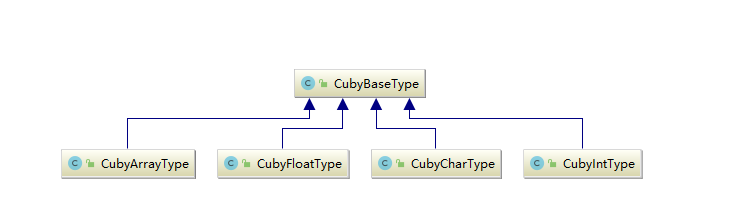

# Cuby
---
- 课程名称：编程语言原理与编译
- 实验项目：期末大作业
- 专业班级：
- 学生学号：
- 学生姓名：
- 实验指导教师: 
- [github](https://github.com/easyBritney/Yuby)
---

## 简介
这是一个编译原理大作业，主要基于microC完成的，这个之所以取名为Cuby，主要是在看`《计算的本质》`这本书的时候，发现Ruby是一门非常好玩有趣的语言，相比C++的错综复杂来说，Ruby是一个集成了优雅与复杂的语言，比如在`irb`下：
```ruby
>> 3.times{puts("Hello world")}
Hello world
Hello world
Hello world
=> 3
>>
```
我看到这门语言的时候我就惊呆了，居然语言还可以这样玩。而C++却令人反胃，实在是太恶心了，虽然说C++给你提供了所有你想用的，但是学习成本高，任何东西都感觉不伦不类的。  
Ruby是一门完全面向对象的编程语言，我尝试去实现面向对象的功能，本来取名叫Yuby，奈何实现面向对象实在太难了，我光是看JVM的指令集就很困难了，还要实现一大堆类库，实在太过于困难了，中途也下过Ruby的源代码，是用C写成的。最后还是放弃了实现面向对象的功能，选择结合microC与Ruby的语法方面作为我们大作业的方向。  
我们打算完善microC并加入Ruby 的 语法，最后如果还有时间的话能够完成面向对象的一个类(最后还是没时间了)。


## 结构
- 前端：由`F#`语言编写而成  
  - `CubyLex.fsl`生成的`CubyLex.fs`词法分析器。
  - `CubyPar.fsy`生成的`CubyPar.fs`语法分析器。
  - `AbstractSyntax.fs` 定义了抽象语法树
  - `Assembly.fs`定义了中间表示的生成指令集
  - `Compile.fs`将抽象语法树转化为中间表示

- 后端：由`Java`语言编写而成
  - `Machine.java`生成`Machine.class`虚拟机与`Machinetrace.class`堆栈追踪

- 测试集：测试程序放在`testing`文件夹内

- 库：`.net`支持
  - `FsLexYacc.Runtime.dll`
## 用法

- `fslex --unicode CubyLex.fsl`  
生成`CubyLex.fs`词法分析器

- `fsyacc --module CubyPar CubyPar.fsy`  
生成`CubyPar.fs`语法分析器与`CubyPar.fsi`  

- `javac Machine.java`  
生成虚拟机

- `fsi -r FsLexYacc.Runtime.dll AbstractSyntax.fs CubyPar.fs CubyLex.fs Parse.fs Assembly.fs Compile.fs ParseAndComp.fs`  
可以启用`fsi`的运行该编译器。

- 在`fsi`中输入:  
`open ParseAndComp;;`

- 之后则可以在`fsi`中使用使用：  

  - `fromString`：从字符串中进行编译

  - `fromFile`：从文件中进行编译

  - `compileToFile`：生成中间表示

例子：

```fsharp
compileToFile (fromFile "testing/ex(struct).c") "testing/ex(struct).out";;  
#q;;


fromString "int a;"
```

生成中间表示之后，便可以使用虚拟机对中间代码进行运行得出结果：


虚拟机功能：
- `java Machine` 运行中间表示
- `java Machinetrace` 追踪堆栈变化

例子：
```bash
java Machine ex11.out 8
java Machinetrace ex9.out 0
```

## 功能实现
- 变量定义
  - 简介：原本的microC只有变量声明，我们改进了它使它具有变量定义，且在全局环境与local环境都具有变量定义的功能。
  - 对比 
    ```C
    // old
    int a;
    a = 3;
    int main(){

        print a;
    } 
    ```
    ```C
    // new (ex(init).c)
    int a = 1;
    int b = 2 + 3;

    int main(){
        int c = 3;
        print a;
        print b;
        print c;
    }
    ```
   - 堆栈图  
   .png)

---

- float 类型
  - 简介：浮点型类型，我们将原本的小数转化为二进制表示，再将这二进制转化为整数放入堆栈中，在虚拟机中再转化为小数。
  - 例子：
    - 例一：   
        ```C
        int main(){
            float a = 1.0;
            print a;
        }
        ```
    - 运行栈追踪：  
        1.png)

    - 例二：
        ```C
        int main(){
            float a = 1.0;
            int b = 2;
            print a+b;
        }
        ```
    - 运行栈追踪：  
        2.png)

---

- char 类型
  - 简介：原本电脑
  - 例子：

    ```C
    int main ()
    {
        char c = 'c';
        print c;

    }
    ```
  - 运行栈追踪：  
    .png)


---
- 自增操作
    - 简介:包含i++ ++i 操作
    - 例子：
        ```C
        int main(){
            int n;
            int a;
            n = 2;
            a = ++n;
            a = n++;
        }
        ```
    - 运行栈追踪：  
        .png)
---
- FOR循环
    - 简介：增加了for循环，以及类似于Ruby的循环
    - 例子：
        ```C
        int main(){
            int i;
            i = 0;
            int n;
            n = 0;
            for(i =0 ; i < 5 ;  ++i){
                n = n + i;
            }
        }
        ```
    - 运行栈追踪：  
        .png)
        ```C
        int main()
        {
            int n;
            int s;
            s = 0;
            for n in (3..7)
            {
                s = s+n;
            }
        }
        ```
    - 运行栈追踪：
        .png)
---
- 三目运算符
    - 简介：三目运算符 a>b?a:b
    - 用例：
        ```C
        int main()
        {
            int a=0;
            int b=7;
            int c = a>b?a:b;
        }
        ```
    - 运行栈追踪：  
        .png)
---
- do - while
    - 简介：在判断前先运行body中的操作。
    - 例子：
        ```C
        int main()
        {
            int n=2;
            do{
                n++;
            }while(n<0);
        }
        ```

  - 运行栈追踪：
    - n++被执行
    - n的终值为3 处于栈中2的位置
    - 堆栈图：
    .png)
---
- 类似C的switch-case
    - 当没有break时，匹配到一个case后，会往下执行所以case的body
    - 若当前没有匹配的case时，不会执行body，会一直往下找匹配的case
    - 之前的实现是递归匹配每个case，当前类似C语言的switch-case实现上在label的设立更为复杂一些。
    - 例子：
        ```C
        int main(){
            int i=0;
            int n=1;
            switch(n){
                case 1:i=n+n;
                case 5:i=i+n*n;
            }
        }
        ```

  - 运行栈追踪：
    - n的值与case1 匹配，没有break， i=n+n与case 5 中的i+n*n都被执行
    - i的结果为（1+1）+1*1 = 3
    - 栈中3的位置为i，4的位置为n
    - 堆栈图：  
    .png)

---

- break功能
    - 在for while switch 中，都加入break功能
    - 维护Label表来实现
    - 例子：与没有break的switch进行对比：
        ```C
        int main(){
            int i=0;
            int n=1;
            switch(n){
                case 1:{i=n+n;break;}
                case 5:i=i+n*n;
            }
        }
        ```
  - 运行栈追踪
    - n的值与case1 匹配，执行i=n+n，遇到break结束。
    - i的结果为（1+1）=2
    - 栈中3的位置为i，4的位置为n
    - 堆栈图：  
        .png)

---
- continue 功能
    - 在for while 中加入continue功能
    - 例子：
        ```C
        int main()
        {
            int i ;
            int n = 0;
            for(i=0;i<5;i++)
            {
                if(i<2)
                    continue;
                if(i>3)
                    break;
                n=n+i;
            }
        }
        ```
  - 运行栈追踪：
    - i=0 1 的时候continue i>3 的时候break
    - n = 2 + 3 结果为5
    - 栈中3的位置为i， 4的位置为n
    - 堆栈图：  
    .png)

--- 

- 结构体功能：
  - 简介：加入了C中的结构体功能，可以嵌套数组
  - 首先，先创建结构体定义表，用来查找，结构体定义表中包含结构体的总体大小，名字，以及变量和偏移量。然后查找结构体变量表，加入该变量到varEnv中，访问成员时，便可以通过`.`运算符，通过偏移值转化为简单指令集。
  - 例子：
    ```C
        struct student{
            int number;
            int number2;
            char name[5];
            float id;
        };
        int main(){
            struct student hello;
            hello.number = 10;
            hello.id = 234;
            hello.name[4] = 'c';
            hello.name[0] = 'a';
            print hello.number;
            print hello.name[4];
        }
    ```

    - 运行栈追踪
    - .png)
---

- JVM
  - 简介：
    - 将之前的虚拟机重新写了一边，原先的虚拟机只能针对int类型进行存储和操作。我具体定义了一些类型，使虚拟机具有较强的拓展性。
  - 类型继承关系图：
    - 
  - 指令集添加：
    - CSTF：
      - 简介：const float
      - 功能：在堆栈中加入一个float
    - CSTC： 
      - 简介：const char
      - 功能：在堆栈中加入一个char
  - 运行时异常：
    - OperatorError:
      - 简介：在计算时发生的异常，例如除数为0时，出现异常。
    - ImcompatibleTypeError:
      - 简介：类型不匹配的时候进行时出现的异常，例如'a' + 1.0 抛出异常。

---
 
- try-catch：
  - 简介：
    - 除0异常捕获：
      - 虚拟机运行时的除0异常
      - 出现显式的除0时THROW 异常
    - 寄存器添加：
      - hr： 保存当前异常在栈中的地址，用于追踪需要处理的异常
    - 指令添加：
      - PUSHHDLR,保存catch中的异常种类，需要跳转的位置以及hr入栈
      - POPHDLR ，与PUSHHDLR对应
      - THROW   ，用于丢出异常，从hr开始找匹配
    - 例子：
  - 目前做了有关除0异常的内容，由于没有异常类，暂且通过字符串的方式作为异常种类，将异常编号匹配。解决了运行时try-catch变量环境的问题，解决了异常处理时栈环境变化带来的空间影响。能够正常的匹配到异常。
    ```C
        int main()
        {
            try{
                int a=0;
                int n=5;
                n=n/a;
            }
            catch("ArithmeticalExcption")
            {
                n=0;
                print n;
            }   
        }
    ```
    - 运行时堆栈：  

- .png)
      


## 技术评价

| 功能 | 对应文件 | 优  | 良  | 中  |
| ---- | -------- | --- | --- | --- |
|变量声明定义|ex(init).c|√|
|自增、自减|ex(selfplus).c|√|
|for循环|ex(for).c|√|
|三目运算符|ex(ternary).c|√|
|do-while|ex(dowhile).c|√|
|while|ex(while).c|√|
|range循环|ex(range).c||√|
|break|ex(break).c|√|
|continue|ex(continue).c|√|
|switch-case|ex(switch).c|√|
|float 类型|ex(float).c|√||
|char 类型|ex(chars).c|√|
|struct结构体|ex(struct).c|√|
|try-catch|ex(exception).c|√
|虚拟机类型支持|Machine.java|√|
|虚拟机异常|exception|√


